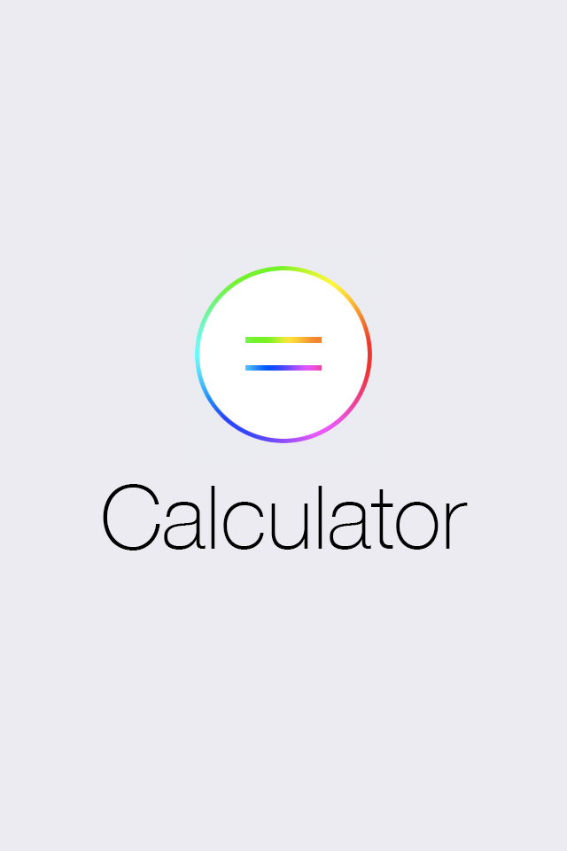
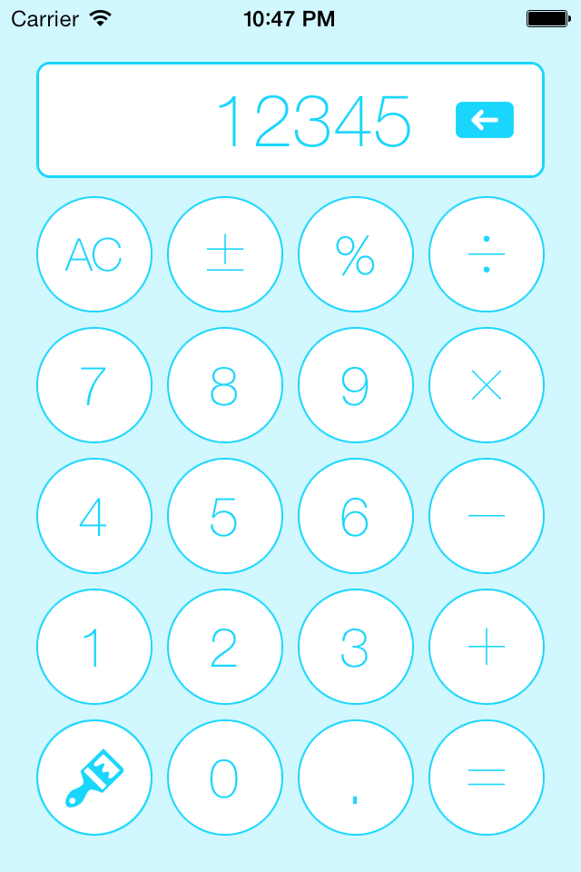
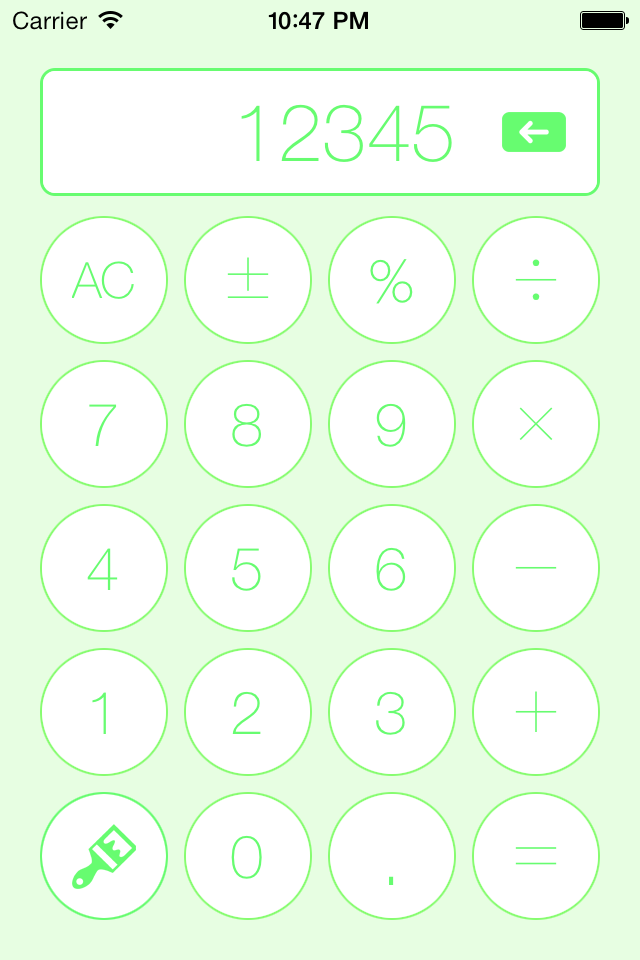
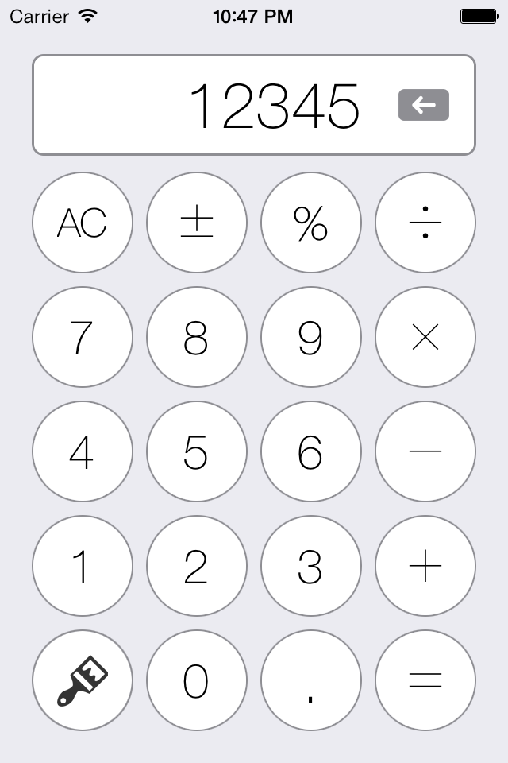
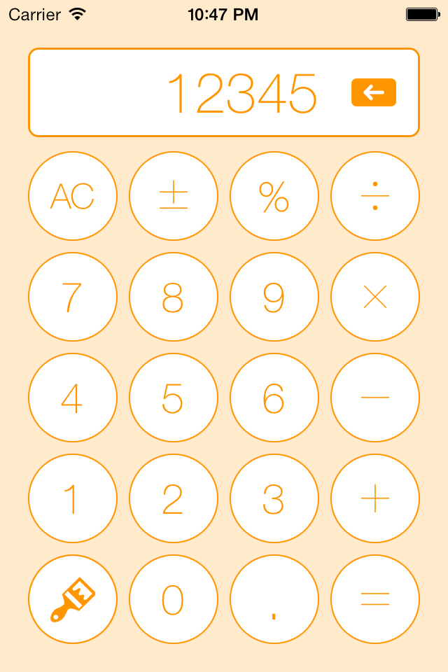
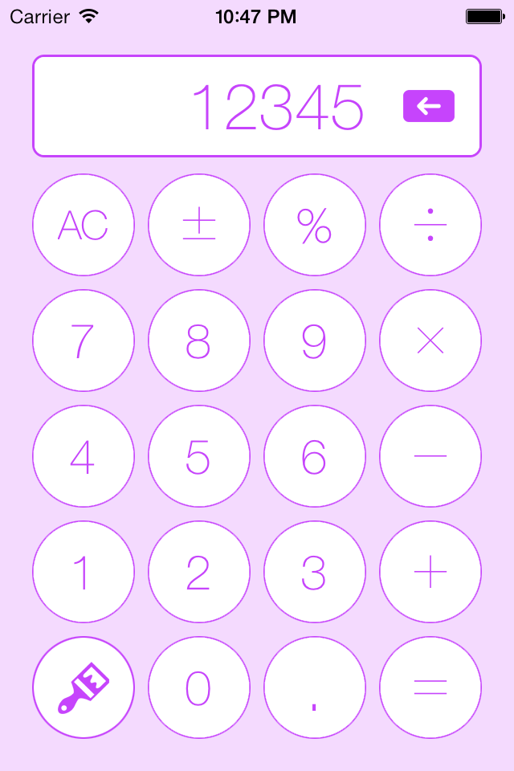
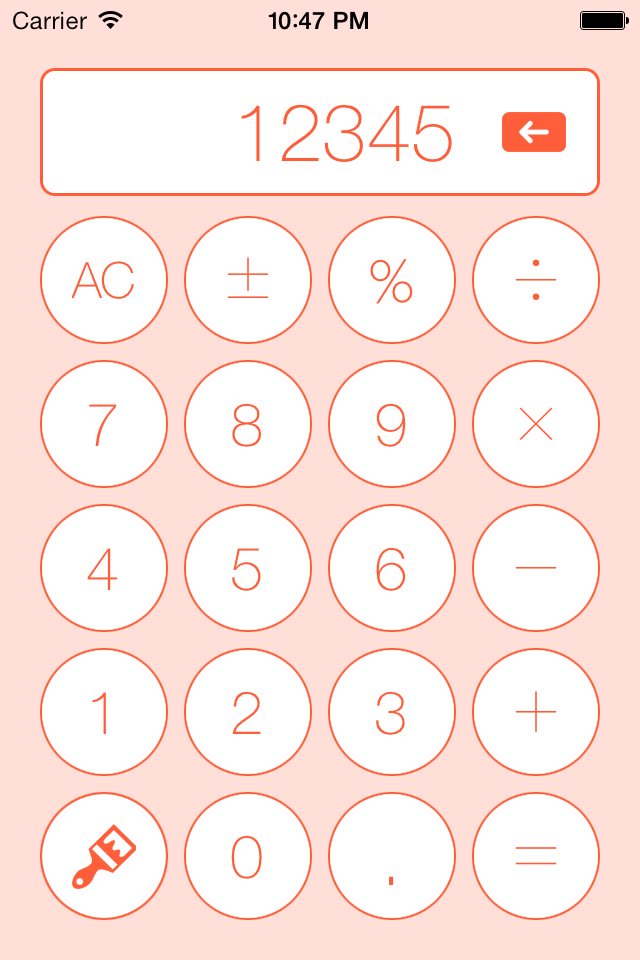
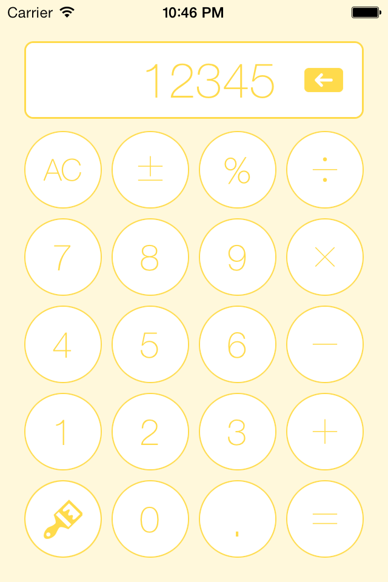

iOS-Simple-Calculator-Application
=================================

My first iOS application written for a contest @teamtreehouse.com

Added a button to change the color of the user interface.

